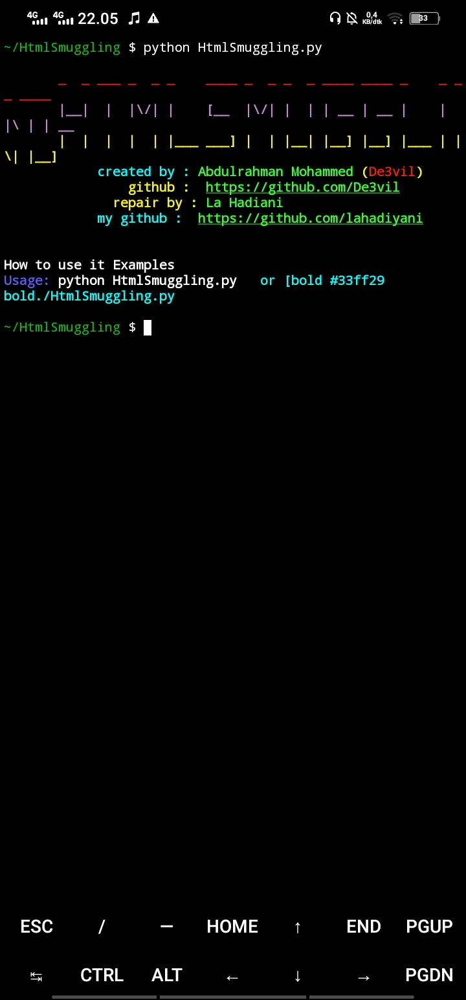

# HtmlSmug

## Deskripsi

HtmlSmug adalah sebuah skrip Python yang digunakan untuk menyembunyikan file malware (file berbahaya) dalam kode HTML yang dieksploitasi. Metode ini memanfaatkan HTML dan JavaScript untuk menyembunyikan file berbahaya dalam kode HTML dan membuat file yang dieksploitasi ini tampak seolah-olah hanya sebuah file HTML biasa. Ketika file HTML ini dibuka oleh korban, JavaScript di dalamnya akan mengekstrak dan mengeksekusi file berbahaya tersebut di sistem korban.

Skrip ini bertujuan untuk mendemonstrasikan bagaimana file berbahaya dapat disembunyikan dalam file HTML sehingga mungkin dapat melewati beberapa mekanisme deteksi keamanan dan antivirus.

## Cara Penggunaan

Untuk menggunakan skrip HtmlSmug, ikuti langkah-langkah berikut:

1. Pastikan Anda telah memiliki Python yang diinstal di komputer Anda.

2. Instal modul `rich` dengan menjalankan perintah berikut di terminal atau command prompt:

   ```
   pip install rich
   ```

3. Simpan skrip HtmlSmuggling.py dalam direktori kerja Anda.

4. Jalankan skrip dengan perintah berikut (gantilah `<FileName>` dengan nama file yang ingin Anda sembunyikan dan `<MalwarePath>` dengan path file berbahaya yang ingin Anda sembunyikan):

   ```
   python HtmlSmuggling.py <FileName> <MalwarePath>
   ```

   Contoh penggunaan:

   ```
   python HtmlSmuggling.py example.html malicious.exe
   ```

5. Skrip akan menyembunyikan file berbahaya dalam kode HTML dan membuat file "mido_template.html" yang berisi kode HTML yang telah dimodifikasi dengan file berbahaya. Selain itu, skrip juga akan membuat file "script.txt" yang berisi kode JavaScript yang digunakan untuk mengekstrak dan mengeksekusi file berbahaya dari file HTML.

6. Anda dapat menyebarkan file "mido_template.html" kepada korban sebagai file HTML biasa. Ketika korban membuka file ini, file berbahaya yang tersembunyi akan diekstrak dan dieksekusi di sistem korban.

## Requirement

- Python 3.x
- Modul `rich`

Pastikan Anda memiliki Python yang terinstal dan telah menginstal modul `rich` sebelum menjalankan skrip ini. 




